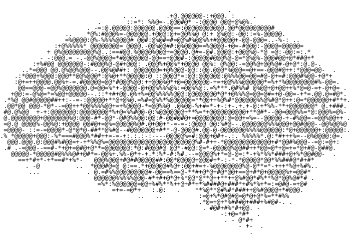

# AI Brain 2 </image>

Codenamed "Project GLaDOS 2" - this is a library for a near-perfect high-level recreation of the human brain - powered by Ollama and Javascript.

Now an actual high-level inerpteration of a brain and not some B-tier "oh i am at *random place* doing *random thing*" crap - unlike AI Brain 1/AI Brain. (Could be considered AGI?)

This is what I like to call "Brain HLE" or "Brain High-Level Emulation." It's like the HLE technique to create game emulators - but for the mind.

This started off as a simple library for building basic brain HLE apps - but then expanded out to a brain simulation, similar to "AI Brain 1" or just "AI Brain" but just the essentials and more accurate brain HLE techniques (see above).
